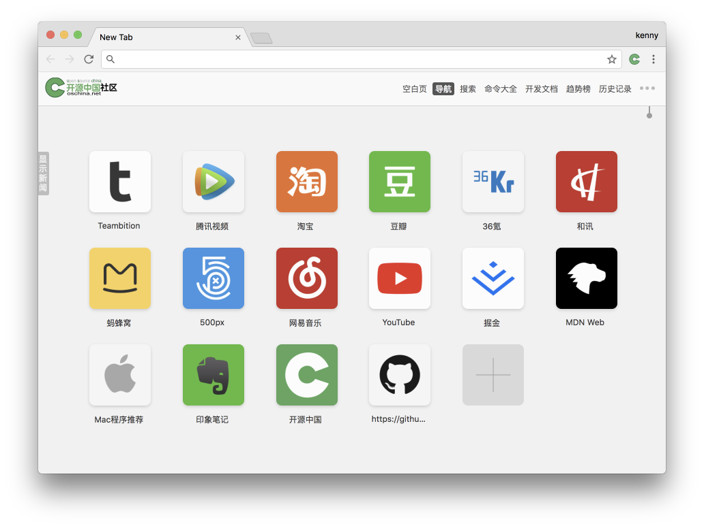

  
  <h1>Chrome 插件网址导航</h1>

Chrome 插件 [oscnews](https://github.com/jaywcjlove/oscnews) 的子仓库，存储网址导航 logo 的仓库。

预览所有 logo 图标：http://jaywcjlove.github.io/logo/

## Chrome插件

可以通过 Chrome 插件 [oscnews](https://github.com/jaywcjlove/oscnews) 来使用网址导航，上面链接是 Chrome 链接下载地址，也可以下载 [crx](https://github.com/jaywcjlove/oscnews/releases) 文件来安装插件。